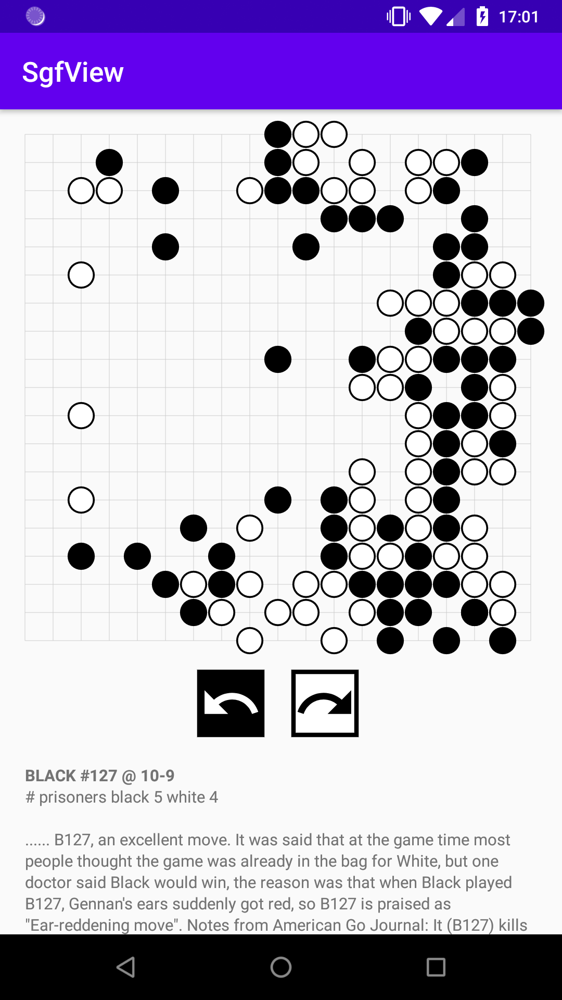
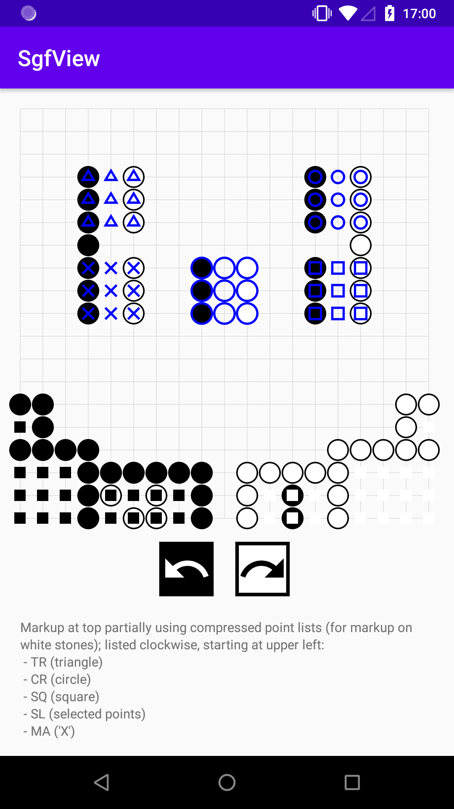

# SgfCharm

This is an [`SGF`](https://www.red-bean.com/sgf/index.html) parser and viewer library for Android, written in Kotlin.

It provides a `GoSgfView` view that can display Go games encoded in an `SGF` file and that allows
user interaction with the game. It can also be used as just a parsing library that converts each
property from the `SGF` to a proper type, allowing type-safe and idiomatic handling in Kotlin.

Only the `FF[4]` standard of the `SGF` specification (i.e., the current one) is implemented so far,
and the `GoSgfView` widget can only handle `SGF` files for the Go game. However, the library was
developed to be as widely applicable to the `SGF` format as possible, so that it should be easy
to use it to define views for other games, as well. See [Customization](#customization) for details.

[Installation](#installation)  
[Basic Usage](#basic-usage)  
[Customization](#customization)
[Release notes](#release-notes)
[Next up](#next-up)
[License](#license)

## Installation

**project `build.gradle`**

	allprojects {
		repositories {
			...
			maven { url 'https://jitpack.io' }
		}
	}
	
**module `build.gradle`**

	dependencies {
		implementation 'com.github.User:Repo:Tag'
	}


## Basic Usage

First, add the view to your layout:
```xml
<sgfcharm.view.GoSgfView
    android:id="@+id/sgfview"
    android:layout_width="wrap_content"
    android:layout_height="wrap_content" />
```
Then, in your code, call
```kotlin
SgfController().load(mySgfString).into(sgfview)
```
where `mySgfString` is a string containing `SGF` data. The result looks like this:

  

You get a view of the board and possibly markup from the file, with undo/redo buttons and additional
text displayed underneath. When there is nothing to undo, the redo button shows the next node or
first variation, if any. You can also interact freely with the board by placing stones on it. It
checks for captures, but it does not check for illegal moves. For example, placing a stone onto an
existing one and suicide are both allowed. This is in accordance with the `SGF` specification of a
`Move`, but I might change this behavior in the future (or at least provide an option to turn it off).

Have a look at the [app module](app) for a slightly more sophisticated example, or at the next section
for an in-depth explanation of the available features.

## Customization

Depending on what you have in mind, a different amount of work is required and different levels of
stability are guaranteed. If you …

* want to use it to display Go `SGF` files and only want to make changes to the default theme,
change the [`GoSgfView` attributes](#styling-the-gosgfview);
* want to use it for `Go` but make more fundamental changes to the appearance, you could implement
the `SgfDrawer` interface or even create your own `View` and have it implement the `SgfView` interface,
see [here](#custom-drawing) for details;
* want to use it for a different game with different rules and possibly different parsing of point/move/
stone types, or need to handle custom `SGF` properties outside of the standard, find out how to
[implement a different game](#implementing-a-different-game);
* just want to use the parsing and/or navigation facilities, read their [documentation](doc/sgfcharm/index.md).

In the following sections are a few "tutorials" showing examples of how to do these things. For more
details, please always refer to the [documentation](doc/sgfcharm/index.md).

### Styling the `GoSgfView`

First of all, let me note that the `GoSgfView` is actually a `TextView`, so all `TextView`
attributes can be used on it and have an effect on the info text displayed below the board.

In addition, the `GoSgfView` has the following `XML` attributes:

   attribute     |                 description                  |   default  |   type
-----------------|----------------------------------------------|------------|-----------
`app:blackColor` | the color used to draw the black stones      | black      | `color`
`app:whiteColor` | the color used to draw the white stones      | white      | `color`
`app:gridColor`  | the color used to draw the grid on the board | light gray | `color`
`app:markupColor`| the color used to draw board markup          | blue       | `color`
`app:showText`   | whether or not to show the information text  | true       | `boolean`

For a little more control, the class also exposes two `Paint` members:

* `piecePaint` used for drawing the stones (but the color will be set according to `blackColor` and `whiteColor`)
* `gridPaint` used for drawing the grid

Finally, `SgfController` offers the possibility to switch the display of variations on the board on
or off, via its `showVariations` property which can also be used in the constructor. Note that the `SGF`
file might also switch this on or off, but the `showVariations` property overrides this (except if
it is set to `null`, which is the default).

### Custom drawing

The easiest way to change the appearance in a bit more fundamental ways than described above is to
implement the `SgfDrawer` interface. Here is an example:

```kotlin
    // inside SgfDrawer object
    override fun Canvas.drawPiece(
        piece: Piece,
        x: Float,
        y: Float,
        size: Float,
        paint: Paint
    ): Boolean {
        val colorValue = piece.color

        paint.apply {
            style = Paint.Style.STROKE
            color = when (colorValue) {
                SgfType.Color.Value.BLACK -> myBlackColor
                SgfType.Color.Value.WHITE -> myWhiteColor
            }
        }

        drawRect(x - size / 2, y - size / 2, x + size / 2, y + size / 2, paint)

        return true
    }
```
This implementation of the `drawPiece` method draws an outlined rectangle, which will be used to draw
the Go pieces. Note the `Piece` object; this is the type of data the `SgfView` receives which encodes
the current situation of the board. The `drawPiece` method has to choose the correct color accordingly.
It should return `true` if it has actually drawn the piece, and `false` otherwise.
```kotlin
    override fun Canvas.drawMarkup(
        markup: Markup,
        x: Float,
        y: Float,
        xTo: Float?,
        yTo: Float?,
        size: Float,
        paint: Paint
    ): Boolean =
        if (markup.type == MarkupType.SELECT) {
            val myPaint = Paint().apply {
                style = Paint.Style.FILL
                color = mySelectMarkupColor
            }

            drawTriangle(x, y, size / 2, myPaint)
            true
        } else false
```
This implementation of `drawMarkup` only does something special for *selection* (`SL`) markups. Instead
of the default (encircling the selected piece), it draws a filled triangle. Note the convenience extension
function `drawTriangle` provided by the library. In all other cases, the function returns `false`, meaning
that these markup types are drawn normally.
```kotlin
    override fun makeInfoText(nodeInfos: List<NodeInfo>, lastMoveInfo: MoveInfo?): CharSequence =
        nodeInfos.filter { it.key == SgfInfoKeys.C }.joinToString("\n")
```
Finally, `makeInfoText` can be used to specify how the textual information from the `SGF` file should
be displayed. Here, it ignores the `MoveInfo` information on the last move and uses only those
`NodeInfo` objects of the current node that have a key `SgfInfoKeys.C`, meaning *comment*, and displays
them interspersed with newlines.

If you merely want to change the string displayed for each informational property, have a look at
`SgfInfoKeys`, which contains the displayed strings.

Now, all that is left is to set the `sgfView.sgfDrawer` to this custom implementation. If you wish to
implement only some of the methods, you can always refer the call to `DefaultSgfDrawer`.

The above approach is not applicable if you …

* want to draw a custom grid or a different kind of board altogether;
* want to include additional buttons or other features;
* want to change the order of the components.

In this case, you will have to make your own `View` and have it implement the `SgfView` interface.
A minimal implementation looks like this:
```kotlin
class MySgfView(context: Context) : View(context), SgfView {
    override var inputListener: SgfInputListener? = null
    override var pieces: List<Piece> = listOf()
    override var nodeInfos: List<NodeInfo> = listOf()
    override var markups: List<Markup> = listOf()
    override var lastMoveInfo: MoveInfo? = null
    override var gridColumns: Int = 0
    override var gridRows: Int = 0
}
```
You do not need to set the properties of the interface in any way; this is done by the `SgfController`.
Your view only needs to implement the logic to display the information contained in those properties;
have a close look at the documentation to find out about it. In particular, you need to call the
`inputListener` when observing a touch event which is relevant to the navigation of the `SGF` file.

### Implementing a different game

From the `SGF` point of view, Go is a simple game: Stones are indistinguishable from each other,
and every move is completely described by the point where a stone is placed. Therefore, `Move`,
`Stone` and `Point` types from `SGF` are all the same for Go and specified by two coordinates.
While this library has abstract data types for `Move`, `Stone` and `Point` that do not make specific
assumptions, the default implementations all assume that they are based on an `XYPoint` type, which
consists simply of two coordinates, given by two letters in the `SGF`.

This means that if you want to implement a `ChessSgfView`, for example, you need to tweak the library
quite a bit:

* a `Stone` now also has a type (Knight, Queen, etc.) and a `Move` consists of two points, so custom `SGF` parsing is required;
* a stones are not removed if they are encircled like in Go, but instead, a stone is captured if a move
was executed landing on it, requiring custom move handling;
* your version of the format might include custom properties that are not part of the `SGF` specification,
in which case you need to specify how to handle these properties;
* stones should be drawn differently and the grid should have a checkerboard pattern, so a new `View`
is required.

Nevertheless, the required changes are relatively straightforward. In fact, I will use the implementation
of a `ChessSgfView` throughout the section as an example.

Let's start at the bottom of the whole process. First of all, we need to define our own `SgfType.Stone`
and `SgfType.Move` types. The `SgfType.Point` can be reused from the `XYPoint` implementation from Go,
as a point in chess can still be defined using two coordinates:
```kotlin
data class ChessStone(val type: ChessStoneType, override val point: SgfType.XYPoint) :
    SgfType.Stone(point)

enum class ChessStoneType {
    KING,
    QUEEN,
    ROOK,
    BISHOP,
    KNIGHT,
    PAWN
}

data class ChessMove(
    val stone: ChessStone,
    override val point: SgfType.XYPoint
) : SgfType.Move(point)
```
As you can see, we define a `ChessStone` type that extens `SgfType.Stone` and overrides its `point`
property. A `ChessMove` then consists of a stone (with its current position) and a point where to move to.
Now we can tell the `SgfParser` how to parse a property value that represents each of these types.
This is done by implementing the `CoordinateParser` interface:
```kotlin
class ChessCoordinateParser : SgfParser.CoordinateParser<SgfType.XYPoint> {
    override fun parsePoint(from: String): SgfType.XYPoint? =
        GoCoordinateParser.parsePoint(from)

    override fun parseStone(from: String): ChessStone? = with(from) {
        firstOrNull()?.toChessStoneType()?.let { stone ->
            parsePoint(drop(1))?.let { point ->
                ChessStone(stone, point)
            }
        }
    }

    private fun Char.toChessStoneType(): ChessStoneType? =
        when (this) {
            'K' -> ChessStoneType.KING
            'Q' -> ChessStoneType.QUEEN
            'R' -> ChessStoneType.ROOK
            'B' -> ChessStoneType.BISHOP
            'N' -> ChessStoneType.KNIGHT
            'P' -> ChessStoneType.PAWN
            else -> null
        }

    @OptIn(Status.Util::class)
    override fun parseMove(from: String): ChessMove? = with(from) {
        parseCompose(::parseStone, ::parsePoint)?.let { (stone, point) ->
            ChessMove(stone, point)
        }
    }

    override fun SgfType.XYPoint.rangeTo(other: SgfType.XYPoint): List<SgfType.XYPoint> =
        with(GoCoordinateParser) {
            this@rangeTo.rangeTo(other)
        }
}
```
To be honest, I did not find any information on how these Chess types are represented in the `SGF`,
but I assumed here that each point is given like in Go, with letters `aa` to `hh`, and a stone has
a capital identifier and a point, like `Peb` for the pawn at `e7` (with the coordinate system starting
at the top left).

`parsePoint` and `rangeTo` (used for parsing compressed point lists) are taken from the `GoCoordinateParser`
as the point types are the same. For a `Stone`, the first character is parsed as type and the rest
as a point. A `Move` is assumed to be a compose type of `ChessStone` and `Stone`, like `Peb:ed`for `e7-e5`.

Note that `parseMove` opts in to the `Status.Util` annotation because it uses `parseCompose`, which
is a utility function provided for these custom purposes but is not regarded part of the official API
of this library. See the [documentation](doc/sgfcharm/onion.w4v3xrmknycexlsd.lib.sgfcharm/-status/index.md)
of the annotations for more information.

Now we only need to set the `coordinateParser` property of the `SgfParser` and the parser will give
us a properly parsed `SgfTree`.

To illustrate how a custom property would be handled, let's say we introduce a new property for castling,
`CS`, and it is a composed type of a `Color` and a `Double` value, where for the latter `1` means
castling short, and `2` means castling long.

The `SgfParser` will turn any property identifier it does not know into a property of type `UNKNOWN`
and it is up to the `SgfNodeHandler` to deal with it. This handler takes a node and processes it,
using and modifying the current (abstract) state of the view via an `SgfState` object.

The handler has three public lambda members that you may replace to influence its functionality.
First, there is `moveHandler` for carrying out moves, then `customPropertyHandler` for handling
`UNKNOWN` properties, and `variationMarker` which can control how variations are marked on the board.

The `moveHandler` should mainly call `SgfState.addPiece` and `SgfState.removePiece` functions to
add or remove pieces. It can find out about the pieces currently on board by inquiring into
`SgfState.currentPieces`. It also has to return a `MoveInfo` object with information about the executed
move, for which it might use the `SgfState.lastMoveInfo` property. Here is a very simple implementation
for chess, which only looks if there is a piece at the target in which case it removes it, and carries out the move:

```kotlin
@OptIn(Status.Impl::class)
fun SgfState.chessMoveHandler(colorValue: SgfType.Color.Value, move: SgfType.Move): MoveInfo? {
    if (move !is ChessMove) return null

    var captured = false
    currentPieces.find { it.stone.point == move.point }?.let { prisoner ->
        removePiece(prisoner)
        captured = true
    }

    removePiece(Piece(colorValue, move.stone))
    val newPiece = Piece(colorValue, ChessStone(move.stone.type, move.point))
    addPiece(newPiece)

    return MoveInfo(
        moveNumber = (lastMoveInfo?.moveNumber ?: 0) + 1,
        lastPlaced = newPiece,
        prisoners = if (captured) when (colorValue) {
            SgfType.Color.Value.BLACK -> (lastMoveInfo?.prisoners?.first ?: 0) to
                    (lastMoveInfo?.prisoners?.second ?: 0) + 1
            SgfType.Color.Value.WHITE -> (lastMoveInfo?.prisoners?.first ?: 0) + 1 to
                    (lastMoveInfo?.prisoners?.second ?: 0)
        }
        else lastMoveInfo?.prisoners ?: (0 to 0)
    )
}
```
As you can see, opting it to use the `Status.Impl` annotated features is required. Next, the handler
for our custom castling property:
```kotlin
@OptIn(Status.Impl::class, Status.Util::class)
fun SgfState.chessPropertyHandler(propIdent: String, propValue: String) {
    if (propIdent == "CS") {
        val (color, length) = propValue.parseCompose(String::parseColor, String::parseDouble)
            ?: return
        when (color.value) {
            SgfType.Color.Value.BLACK -> {
                when (length.value) {
                    SgfType.Double.Value.MUCH -> {
                        chessMoveHandler(
                            color.value,
                            ChessMove(
                                ChessStone(ChessStoneType.KING, SgfType.XYPoint(5, 1)),
                                SgfType.XYPoint(7, 1)
                            )
                        )
                        chessMoveHandler(
                            color.value,
                            ChessMove(
                                ChessStone(ChessStoneType.ROOK, SgfType.XYPoint(8, 1)),
                                SgfType.XYPoint(6, 1)
                            )
                        )
                    }
                    SgfType.Double.Value.VERY_MUCH -> {} // TODO
                }
            }
            SgfType.Color.Value.WHITE -> {
                when (length.value) {
                    SgfType.Double.Value.MUCH -> {} // TODO
                    SgfType.Double.Value.VERY_MUCH -> {} // TODO
                }
            }
        }
    }
}
```
As you can see, it first checks if the passed property identifier is `CS`, and then it calls the
`chessMoveHandler` just defined to carry out two moves; note that this is actually wrong as castling
should be counted as one move, but it should be enough for illustration purposes.

As to the matter of variations, the Go way of just marking the point where the next move occurs isn't
suitable for chess as each move has a start and end point and there might be coincides for different
stones. The following implementation simply draws arrows from start to end:
```kotlin
@OptIn(Status.Impl::class)
fun SgfState.chessVariationMarkup(moves: List<SgfType.Move?>): List<Markup> {
    val markup = moves.map {
        (it as? ChessMove)?.let { (stone, point) ->
            Markup(MarkupType.ARROW, stone.point, point)
        }
    }

    // deal with `null` entries ...

    return markup
}
```
The function receives a list of moves and has to return a list of `Markup` objects describing how
the move should be marked, in the order of the moves received. Note that some of the moves might be
`null`, which is the case if the variation does not contain a move in its first node. Those entries
must be dealt with somehow; the default implementation simply places them on the middle row of the
board, taking care that no coincidences occur, but you are free to do what you want here.

All that is left now is to set the properties of the node handler of the controller to our implementation:
```kotlin
sgfController.sgfNodeHandler.apply {
    moveHandler = SgfState::chessMoveHandler
    customPropertyHandler = SgfState::chessPropertyHandler
    variationsMarker = SgfState::chessVariationMarkup
}
```
At this point you are ready to create your own view and have it implement `SgfView` as described
[here](#custom-drawing).

### Limitations

What you cannot do with this library:
* automatically handle `SGF` files from versions earlier than `FF[4]` (you can handle them as custom
properties, though)
* automatically handle text encodings other than `utf-8` (but you can of course simply reencode your string beforehand)
* things that don't have anything to do with `SGF` (I think)

## Release notes

### 2020-05-14 version 0.0.1

Initial release! Not yet thoroughly tested, but working so far. Features:

* a `GoSgfView` to display `SGF` files for the Go game
* a highly customizable parsing library for `SGF` files
* an `SgfView` interface, allowing custom drawing while taking advantage of the existing parsing and navigation facilities

## Next up

* [ ] save and restore the view state on configuration changes
* [ ] cache the current board state and use coroutines for better performance
* [ ] deal with changes of board size without glitching

## License

    Copyright [2020] [w4v3]

    Licensed under the Apache License, Version 2.0 (the "License");
    you may not use this file except in compliance with the License.
    You may obtain a copy of the License at

        http://www.apache.org/licenses/LICENSE-2.0

    Unless required by applicable law or agreed to in writing, software
    distributed under the License is distributed on an "AS IS" BASIS,
    WITHOUT WARRANTIES OR CONDITIONS OF ANY KIND, either express or implied.
    See the License for the specific language governing permissions and
    limitations under the License.
